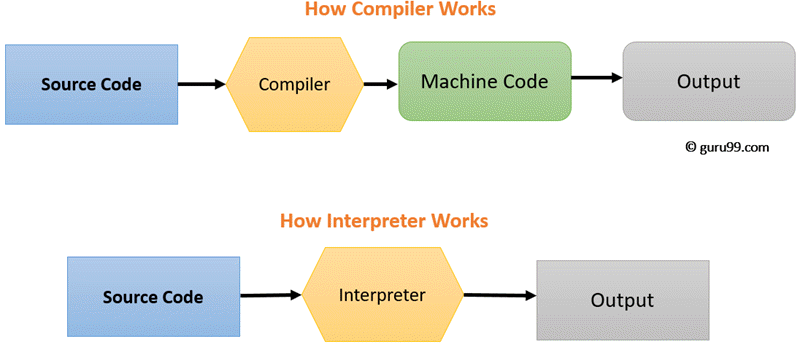

# Lecture 3:
 ## What is programming language ?
- computer language engineered to create a standard form of commands . this can be interpreted into code can be understood by a machine. 
- is a set of instructions for a digital computer . such instructions can be executed directly when they are in the computer manufacturer-specific numerical form known as Machine Language.
- is also known as programming system, computer language, computer system.
- is split into the two components of `Syntax(Form)`, `smenatics(Meaning).`
 ## General computer Language Are :
### `1- Machine Language:` 
- is the lowest level programming language `Binary`
### `2- Assembly Language:`
- instead of Using of numbers that computers could directly understand,<br> Programmers began using english-like abbreviations to present elementary operations.
- because computer can not execute assembly language another program called `Assembler`
### `3- High Level Language:`
- to speed the programming process.
- developed in which single statements could be written to accomplish tasks .
- translator called as `compiler`.
- programs that written in high level language is called `Source Code`.
> note that a statement from source code may be translated into several machine instructions.
## Difference Between compiler and interpreter:
 ### `Compiler` :
- translate entire source code into machine code file and machine-code file then executed.
### `interpreter`:
- reads one statement from source code, translate it to machine code, and then execute it  right way. 





<hr>

> c++ programs typically go through 6 phases to be executed:<br> 
`1- Creating a program.`<br>`2&3- processing and compiling.`<br> `4-Linking.`<br> `5-Loading.`<br> `6- Execution.`
<hr>

## Let's understand structure of c++ Code:
 
````c++
# include <iostream>
using namespace std;
int main ()
{
    //This is single line comment 
    /* this using in
       multi line comment*/
    cout << "Hello This Is First C++ Program\n";
    cout << "\\Line 1\n";
    cout << "Line 1\n";
    cout << "Line 1\n";

    return 0;
}
````
## `Escape Sequences :`

- Special Non Printing Characters
- Control Printing Behaviour
- Start With BackSlash "\"
- Can Be Inserted In Any Position
- `\n`: Make New line.
-  `\t`: Make Horizontal Tab  equal 8 spaces.
-  `\\`: Insert a backslash Character in a string.
-  `\"`: Insert Double Quote Character in a string.
-  `\b`: backspace.
-  `\a` : Alert => Play Beep During Execution.
- `\r` : Carriage Return.
## Example 
````c++
#include <iostream>
using namespace std;

int main()
{
  cout << "Line 1\n"; // new line
  cout << "Line 2\n";
  cout << "Line 3\\\n"; // Line 3\ + new line
  cout << "Line \"4\"\n"; // Line "4" + new line
  cout << "Line 5\n"; 
  cout << "Line\t6\n";  // Line        6 make 8 spaces
  cout << "Line\b7\n"; // Lin7
  cout << "Line 8\a\n";
  cout << "Aya\rosama\n"; // osama will make an override on aya 
  cout << "Line"; // This Is Line \\
  return 0;
}
````
