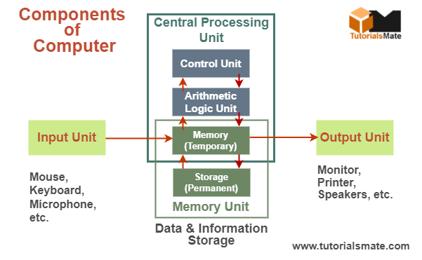

# Introduction:
## What is computer ?
- Is an electronic device that accepts data as input, stores or processes the input as per user instructions and provides information as output in desired format.
## `Data :` 
- Are Row facts may not make much meaning to the user.
## `Processes :`
- Are Set of instructions that instruct computer what to do .
## `Information or  Output :`
- Is result after data has been processed.

# Computer system :
- consists of mainly four basics units;
- (`input unit`, `storage unit`, `central processing unit`, `output unit`)
### `central Processing Unit ` consists of :
- (Arithmetic logical unit `ALU`, 
- Control Unit `CU`)

- 

> All types of computers follow the same basic logical structure and perform `Five` basic operation . 
> for converting row input data into information useful to their users .

## What is five basic operation ?
- `Take Input` : 
    - The process of entering data and the instructions into the computer system.
- `Store Data `:
    - Saving data and instructions so that they are available for processing and when required.
- `Processing Data`:
    - Process of performing arithmetic and logical operations on data in order to convert them into useful information.
- `Output Information`:
    - The Process of producing useful information .
- `Control The Workflow` :
    - Directs manner and sequence in which all the above operations are performed.

# component of computer:
- `SoftWare` : are system and application programs. 
- `HardWare` : are the physical entities like (wires, mechanical components in peripheral devices used for storage information)

## what is general purpose of computer system?
  - Is a programmable  machine that can solve problems by accepts inputs and instructions on how to use this inputs.

# lecture 2  :
  ## The Main Element Associated With Computer System are :
   ### HardWare Component:
  - `Central Processing Unit CPU` : Data Processing And Control.
  - `Main Memory ` : Primary Storage.
  - `Secondary Storage` : Stores Permanent Data.
  - `Input& Output Devices` : Move Data Between The computer And Its External Environment.
  - `Communication Devices` : Provides Mechanism For Communication Among Various Components.

  ## SoftWare :
 - is a set of instructions that makes computer perform tasks.
 - the term program refer to any piece of software.
 - software is intangible side of the computer.
 - if the cpu is physical brain of the computer, then software is its mind.
 ### What Is Different Methods To Obtain A Software ?
- commercial Software:
   - copyrighted you should pay for it.
- Public Domain Software:
   - Not Copyrighted you can get it for free.
- shareware:
  - copyrighted available free but should pay to continue using it .
- Freeware:
  - Copyrighted Available Free.
- Rental ware:
  - Copyrighted Lease for a fee.
### What Is Main Types Of Software ?
- System Software:
  - is directly controls computer's hardware.
  - manages computer's resources.
  - enables various components of computers to communicate.
  - runs application software.
  - helps computer manage it's internal and external resources.
  - makes hardware respond to the user needs.
- Application Software:
  - is a set of computer instructions that provide more specific functionality to user. 